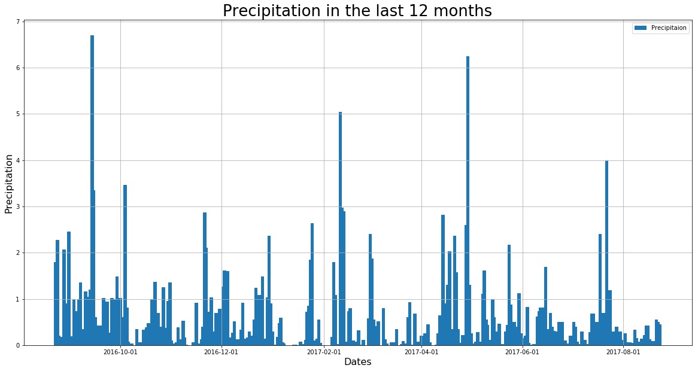
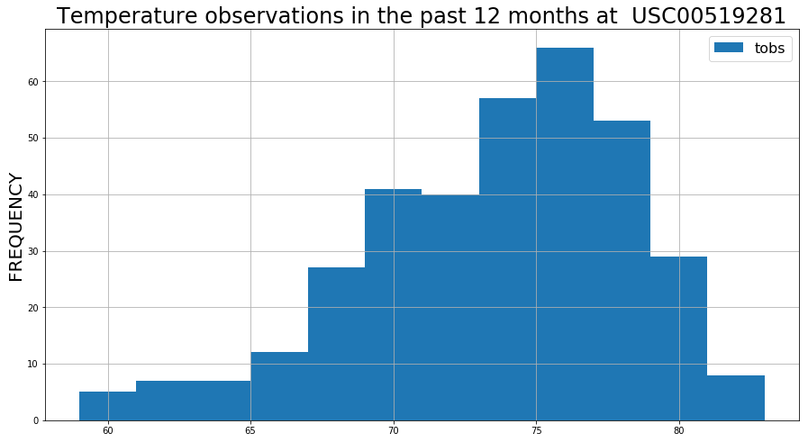
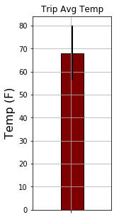

```python
# Python SQL toolkit and Object Relational Mapper
import sqlalchemy
from sqlalchemy.ext.automap import automap_base
from sqlalchemy.orm import Session
from sqlalchemy import create_engine,inspect, func

import datetime as dt

import pandas as pd

import matplotlib.pyplot as plt
import seaborn as sns

import numpy as np


```


```python
# Create engine using the `demographics.sqlite` database file
engine = create_engine("sqlite:///hawaii.sqlite")
```


```python
# Declare a Base using `automap_base()`
Base = automap_base()
```


```python
# Use the Base class to reflect the database tables
Base.prepare(engine, reflect=True)
```


```python
# Print all of the classes mapped to the Base
Base.classes.keys()
```


    ['Measurement', 'Station']


```python
# Assign the Measurement class, Station class to a variables called Measurement and Station respectively
Measurement = Base.classes.Measurement
Station = Base.classes.Station
```


```python
# Create a session
session = Session(engine)
```


```python
# Last Observation date in the measurement table
LastObservationdate = session.query(Measurement.date).order_by(Measurement.date.desc()).first()
lastDatestr = str(LastObservationdate[0])
LastDate = dt.datetime.strptime(lastDatestr, '%Y-%m-%d')

#A date one year ago
DateOneYearAgo = LastDate - dt.timedelta(days=365)
DateOneYearAgo = dt.datetime.strftime(DateOneYearAgo, '%Y-%m-%d')

print(DateOneYearAgo)
```

    2016-08-23
    


```python
# Precipitation Analysis for the last 12 months
precipitationResults = session.query(Measurement.date ,Measurement.prcp ).filter(Measurement.date >= DateOneYearAgo).all()
precipitationDf = pd.DataFrame(precipitationResults)
precipitationDf = precipitationDf[['date','prcp']]
#precipitationDf.reset_index(drop=True)
#precipitationDf.set_index('date', inplace = True)
#precipitationDf.set_index('date', inplace=True, drop=True)
#precipitationDf.head()
precipitationDf.set_index('date', inplace = True)
precipitationDf.index = pd.to_datetime(precipitationDf.index)
precipitationDf.head()
```


<div>
<style>
    .dataframe thead tr:only-child th {
        text-align: right;
    }

    .dataframe thead th {
        text-align: left;
    }

    .dataframe tbody tr th {
        vertical-align: top;
    }
</style>
<table border="1" class="dataframe">
  <thead>
    <tr style="text-align: right;">
      <th></th>
      <th>prcp</th>
    </tr>
    <tr>
      <th>date</th>
      <th></th>
    </tr>
  </thead>
  <tbody>
    <tr>
      <th>2016-08-23</th>
      <td>0.00</td>
    </tr>
    <tr>
      <th>2016-08-24</th>
      <td>0.08</td>
    </tr>
    <tr>
      <th>2016-08-25</th>
      <td>0.08</td>
    </tr>
    <tr>
      <th>2016-08-26</th>
      <td>0.00</td>
    </tr>
    <tr>
      <th>2016-08-27</th>
      <td>0.00</td>
    </tr>
  </tbody>
</table>
</div>


```python
precipitationDf.index

```


    DatetimeIndex(['2016-08-23', '2016-08-24', '2016-08-25', '2016-08-26',
                   '2016-08-27', '2016-08-28', '2016-08-29', '2016-08-30',
                   '2016-08-31', '2016-09-01',
                   ...
                   '2017-08-10', '2017-08-12', '2017-08-14', '2017-08-15',
                   '2017-08-16', '2017-08-17', '2017-08-19', '2017-08-21',
                   '2017-08-22', '2017-08-23'],
                  dtype='datetime64[ns]', name='date', length=2021, freq=None)


```python

import matplotlib.dates as mdates

fig, ax = plt.subplots(figsize = (20,10))
ax.bar(precipitationDf.index,precipitationDf['prcp'],width =2)

ax.xaxis.set_major_formatter(mdates.DateFormatter('%Y-%m-%d'))

ax.set_xlabel('Dates', fontsize = 16)
ax.set_ylabel('Precipitation',fontsize = 16)
ax.set_title('Precipitation in the last 12 months',fontsize= 26)
ax.legend(['Precipitaion'])
ax.grid(True)

```





```python
precipitationDf.describe()
```


<div>
<style>
    .dataframe thead tr:only-child th {
        text-align: right;
    }

    .dataframe thead th {
        text-align: left;
    }

    .dataframe tbody tr th {
        vertical-align: top;
    }
</style>
<table border="1" class="dataframe">
  <thead>
    <tr style="text-align: right;">
      <th></th>
      <th>prcp</th>
    </tr>
  </thead>
  <tbody>
    <tr>
      <th>count</th>
      <td>2021.000000</td>
    </tr>
    <tr>
      <th>mean</th>
      <td>0.177279</td>
    </tr>
    <tr>
      <th>std</th>
      <td>0.461190</td>
    </tr>
    <tr>
      <th>min</th>
      <td>0.000000</td>
    </tr>
    <tr>
      <th>25%</th>
      <td>0.000000</td>
    </tr>
    <tr>
      <th>50%</th>
      <td>0.020000</td>
    </tr>
    <tr>
      <th>75%</th>
      <td>0.130000</td>
    </tr>
    <tr>
      <th>max</th>
      <td>6.700000</td>
    </tr>
  </tbody>
</table>
</div>


```python
#Number of stations
len(session.query(func.distinct(Measurement.station)).all())


```


    9


```python
#Most Active Stations
session.query(Measurement.station,func.count(Measurement.station)).\
    group_by(Measurement.station).\
    order_by(func.count(Measurement.station).desc()).all()

```


    [('USC00519281', 2772),
     ('USC00513117', 2696),
     ('USC00519397', 2685),
     ('USC00519523', 2572),
     ('USC00516128', 2484),
     ('USC00514830', 1937),
     ('USC00511918', 1932),
     ('USC00517948', 683),
     ('USC00518838', 342)]


```python
#Most Active Station
MostActiveStation = session.query(Measurement.station,func.count(Measurement.station)).\
    group_by(Measurement.station).\
    order_by(func.count(Measurement.station).desc()).first()
MostActiveStation = MostActiveStation[0] 
print("The Most active station is  : " + MostActiveStation)
```

    The Most active station is  : USC00519281
    


```python
# Temperature observations for the last 12 months of the dataset
TempObservation = session.query(Measurement.tobs).filter(Measurement.date >= DateOneYearAgo). \
                                                filter(Measurement.station ==MostActiveStation).all()
TempObservationDf = pd.DataFrame(TempObservation)
TempObservationDf.describe()
```


<div>
<style>
    .dataframe thead tr:only-child th {
        text-align: right;
    }

    .dataframe thead th {
        text-align: left;
    }

    .dataframe tbody tr th {
        vertical-align: top;
    }
</style>
<table border="1" class="dataframe">
  <thead>
    <tr style="text-align: right;">
      <th></th>
      <th>tobs</th>
    </tr>
  </thead>
  <tbody>
    <tr>
      <th>count</th>
      <td>352.000000</td>
    </tr>
    <tr>
      <th>mean</th>
      <td>73.107955</td>
    </tr>
    <tr>
      <th>std</th>
      <td>4.733315</td>
    </tr>
    <tr>
      <th>min</th>
      <td>59.000000</td>
    </tr>
    <tr>
      <th>25%</th>
      <td>70.000000</td>
    </tr>
    <tr>
      <th>50%</th>
      <td>74.000000</td>
    </tr>
    <tr>
      <th>75%</th>
      <td>77.000000</td>
    </tr>
    <tr>
      <th>max</th>
      <td>83.000000</td>
    </tr>
  </tbody>
</table>
</div>


```python
#Plotting Temperature observations at the most active station

TempObservationDf.hist(bins = 12,figsize =(15,8))

plt.title("Temperature observations in the past 12 months at  " + MostActiveStation, fontsize = 24)
plt.legend(['tobs'], fontsize = 16)
plt.ylabel('FREQUENCY', fontsize = 20)
```


    Text(0,0.5,'FREQUENCY')





```python
#Trip Planning!
# Assumption : Planning for a weeklong trip starting on 2017-01-01 and ending on 2017-01-07

def calc_temps( startdate, enddate ):    
    minTemp = session.query(func.min(Measurement.tobs)).filter(Measurement.date >= startdate).filter(Measurement.date <= enddate).all()
    minTemp = minTemp[0]
    #print(minTemp)
    maxTemp = session.query(func.max(Measurement.tobs)).filter(Measurement.date >= startdate).filter(Measurement.date <= enddate).all()
    maxTemp = maxTemp[0]
    #print(maxTemp)
    avgTemp = session.query(func.avg(Measurement.tobs)).filter(Measurement.date >= startdate).filter(Measurement.date <= enddate).all()
    avgTemp = avgTemp[0]
    #avgTemp = np.round(avgTemp,1)
    #print(avgTemp)
    return(minTemp, avgTemp, maxTemp)

TempResults = calc_temps("2017-01-01","2017-01-07")

#print(calc_temps("2017-01-01","2017-01-07"))
MinTemp = TempResults[0][0]
AvgTemp = TempResults[1][0]
MaxTemp = TempResults[2][0]
print(MinTemp )
print(AvgTemp )
print(MaxTemp )

TempDf = pd.DataFrame({'MinTemp':MinTemp,'MaxTemp':MaxTemp,'AvgTemp':AvgTemp}, index =[" "])
#df=pd.DataFrame({'A':np.random.rand(2),'B':np.random.rand(2)},index=['value1','value2'] )         

TempDf.head()
```

    62.0
    68.1025641025641
    74.0
    


<div>
<style>
    .dataframe thead tr:only-child th {
        text-align: right;
    }

    .dataframe thead th {
        text-align: left;
    }

    .dataframe tbody tr th {
        vertical-align: top;
    }
</style>
<table border="1" class="dataframe">
  <thead>
    <tr style="text-align: right;">
      <th></th>
      <th>AvgTemp</th>
      <th>MaxTemp</th>
      <th>MinTemp</th>
    </tr>
  </thead>
  <tbody>
    <tr>
      <th></th>
      <td>68.102564</td>
      <td>74.0</td>
      <td>62.0</td>
    </tr>
  </tbody>
</table>
</div>


```python
#Plottting The Avg Temp

AvgTemp = TempDf["AvgTemp"]
err = TempDf["MaxTemp"] - TempDf["MinTemp"]
fig, ax = plt.subplots()
AvgTemp.plot(kind='bar',yerr=err,colormap='OrRd_r',edgecolor='black'\
             ,grid= True,figsize=(2,5),ax=ax,position=0.45,\
             error_kw=dict(ecolor='black',elinewidth=2),width=0.2)
ax.set_ylabel('Temp (F)', fontsize = 16)
ax.xaxis
plt.title("Trip Avg Temp")
plt.show()

```




